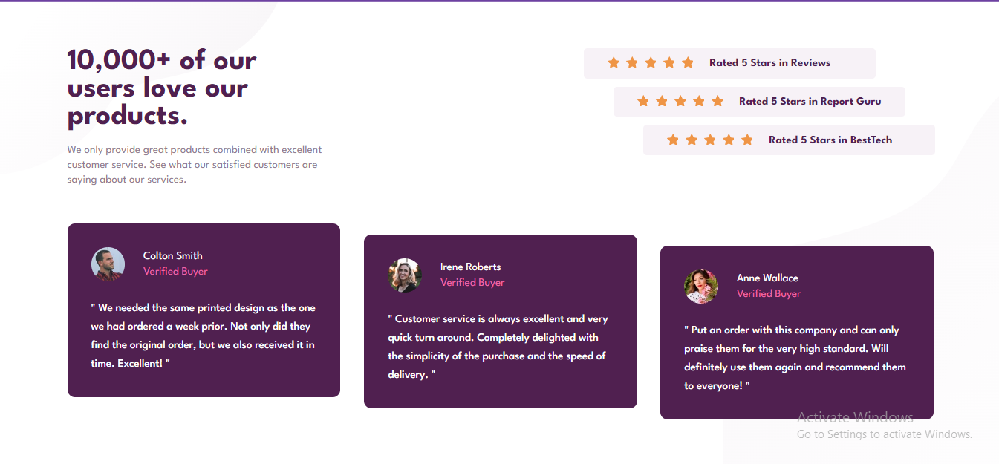
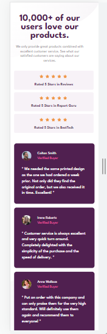

# Frontend Mentor - Social proof section solution

This is a solution to the [Social proof section challenge on Frontend Mentor](https://www.frontendmentor.io/challenges/social-proof-section-6e0qTv_bA). Frontend Mentor challenges help you improve your coding skills by building realistic projects.

## Table of contents

- [Overview](#overview)
  - [The challenge](#the-challenge)
  - [Screenshot](#screenshot)
  - [Links](#links)
- [My process](#my-process)
  - [Built with](#built-with)
  - [What I learned](#what-i-learned)
  - [Continued development](#continued-development)
  - [Useful resources](#useful-resources)
- [Author](#author)
- [Acknowledgments](#acknowledgments)

## Overview

### The challenge

Users should be able to:

- View the optimal layout for the section depending on their device's screen size

### Screenshot

### Links

- Solution URL: [Add solution URL here](https://your-solution-url.com)
- Live Site URL: [Add live site URL here](https://your-live-site-url.com)

### Built with

- Semantic HTML5 markup
- CSS custom properties
- Flexbox
- Mobile-first workflow

### What I learned

I learned how to use positioning the right way with this challenge. I always assumed that absolute positioning was the only way to position child elements and it always had to be in relation to the parent, SIGHHH, this gave me a really tough time before I realized that relative positioning is not used only for a parent element but can be used to position any element at all as desired. A lightbulb moment right there!

I also learned a lot about using svg as background images and all the good stuff that can be done with it.

### Continued development

Although I've learned a lot about svgs and gotten more familiar with how they can be helpful both as icons and background images, I unfortunately could not get it to work for my background image as expected on this challenge. #sadface. I however have decided to submit my challenge regardless because I don't want that blocker to weigh me down. I believe that this is the whole point of these challenges. Not to be perfect but to learn and be teachable and I am both!

### Useful resources

The Kevin Powell 21 days Conquering Responsive layout challenge has really helped my understanding of responsive layouts. Although I'm not there yet, I'm grateful for that and many of his other videos.

**Note: Delete this note and replace the list above with resources that helped you during the challenge. These could come in handy for anyone viewing your solution or for yourself when you look back on this project in the future.**

## Author

- Website - [Maria Fadeyi](https://github.com/Layo-hue)
- Frontend Mentor - [@Layo-hue](https://www.frontendmentor.io/profile/Layo-hue)
